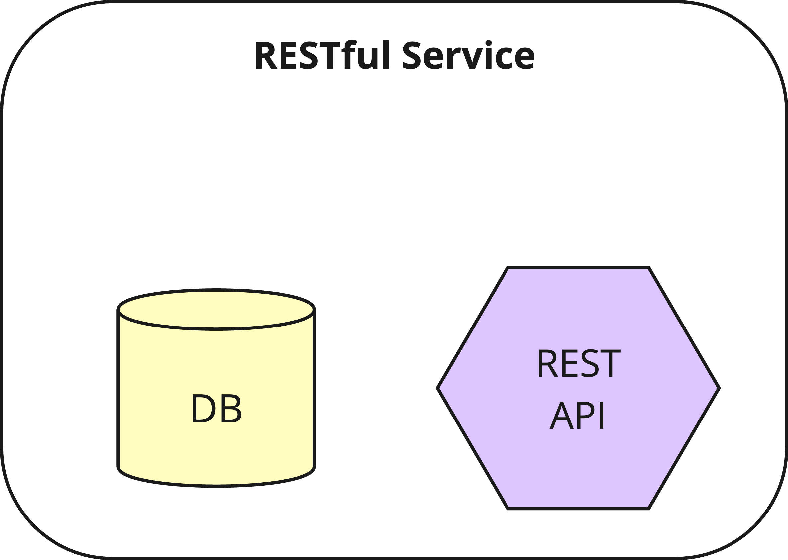
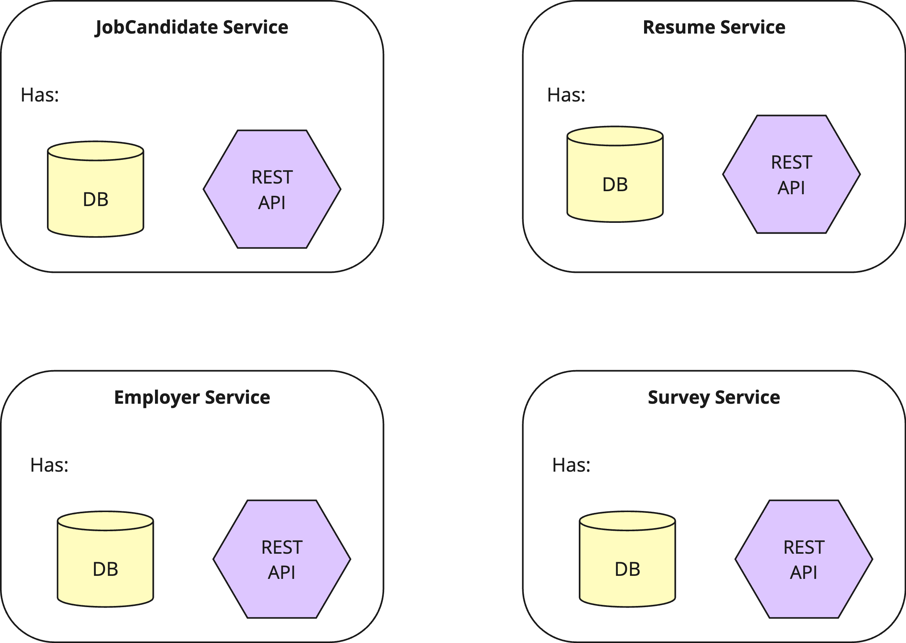
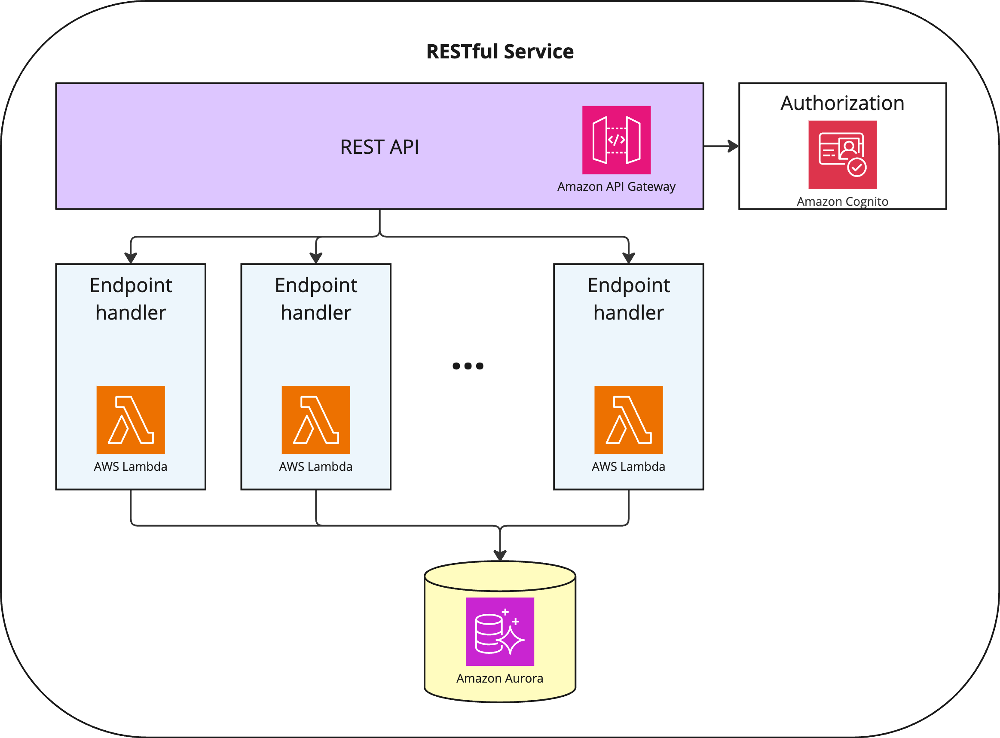

# Status

Approved

Viktor Isaev, Denis Iudovich, Ivan Kunyankin, Kiril Stoilov

# Context

We have designed our [Core Domain Model](../Diagrams/Core%20Domain%20Model.png) . The data of this 
model is stored persistently in the Primary Database (see 
[ADR-6 - Primary Database](./ADR-6%20-%20Primary%20Database.md) ), and the Service Workers from our 
Workflow Engine ([ADR-9 - Workflow Engine](./ADR-9%20-%20Workflow%20Engine.md) ) will need to access 
this data: read it and update, when needed.

We need to design a way this is done.

# Decision

We decide to implement access to the Core Domain Model with *RESTful Services*.

A RESTful Service is a software component that has a RESTful API and a persistent storage. A RESTful service stores a 
part of Core Domain Model in its persistent storage, and provides access to this data though its RESTful API. A RESTful 
service has exclusive access to its persistent storage - no other component is able to access it directly and only uses 
the API for that purpose.

We implement one RESTful Service per [bounded context](../Terms/Bounded%20context.md) in 
our Core Domain Model. We get the following RESTful Services as a result:

Each RESTful Service handles a part of the Core Domain Model, and is fully responsible for the persistence, safety, and 
correctness of the data it deals with. This way, our Primary Database is broken into independent pieces by number of
[bounded contexts](../Terms/Bounded%20context.md).

## Implementation

We recommend to implement RESTful Services by using serverless technologies: [AWS 
Lambda](https://aws.amazon.com/lambda/) and [AWS API Gateway](https://aws.amazon.com/api-gateway/). This minimizes the 
cost of running these services while providing scalability and availability out of the box. The serverless architecture 
for a single RESTful Service is explained on the diagram below:

An implementation team may choose a different approach if deemed expedient.

## Alternatives

We could have implemented our Primary Database as a single, central database, and make Service Workers access it 
directly with SQL queries. This would have simplified the architecture and deployment. However, this approach makes it 
very difficult to evolve the system: changing the data schema may become unmanageable, because any change can break a 
Service Worker (or even multiple Service Workers), because they are using the SQL queries assuming a given database 
schema. A RESTful API, on the other hand, is a contract between a RESTful Service and all of the Service Workers, which 
either never changes (we can make a new version of an API any time, while still supporting an old version until all 
workers migrate), or changes in a controlled way (we do backward-compatible changes).

The other alternative is to use one single RESTful Service for the whole Domain Model. This is a better approach, but 
it may become difficult to scale in terms of development. When many developers work on a single service, they start 
stepping on each-others tows at some point (changes in one part of the service suddenly breaks the other part; 
concurrent changes become difficult to merge, etc.), and the time-to-market becomes longer and longer. Breaking the 
Primary Database into a set of independent services helps ensuring there is always a limited number of developers in 
charge of any given service.

# Consequences

## Positive

- Our development process will be easy to scale.
- Our Service Workers will not depend on any particular technology when dealing with the data from Core Domain Model. 
We will be able to easily experiment and change the implementation stack for any particular service without breaking 
the rest of the system.
- Based on the APIs of RESTful Services, it will be very easy to build the APIs for any particular task, like making a 
Web frontend or a mobile application.

## Negative

- Joining the data from multiple [bounded contexts](../Terms/Bounded%20context.md) (in 
case we need it) will work much slower that if we’d used a single database with JOIN instructions inside an SQL query.

## Reversibility

This is a **one-way decision** that is difficult to change in the future. Once we pick this approach, changing it to a 
different one is difficult an costly. Breaking a single RESTful Service into multiple ones, or merging multiple RESTful 
Services into a single one also has significant development costs.
