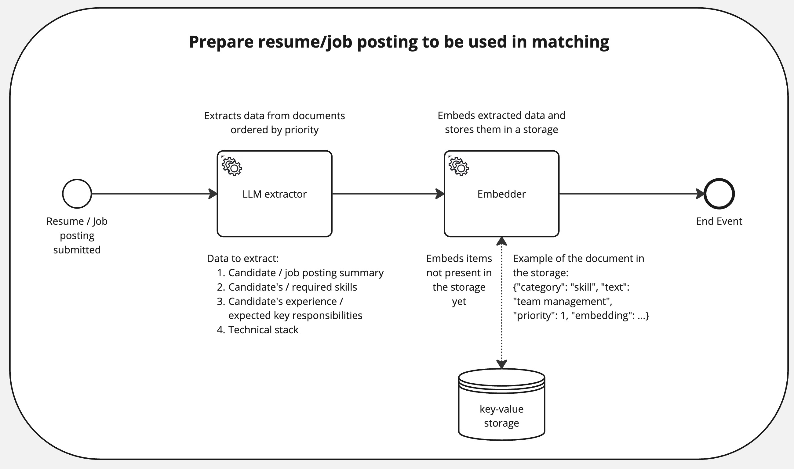

# **Status**

Approved

Zhivko Angelov, Ivan Kunyankin, Denis Iudovich, Kiril Stoilov

# **Context**

We need a Matching engine component that connects Candidates with the Open positions. Matching engine is essential to 
simplify the hiring process for employers and increase the probability for the candidate to find a suitable position.

The proposed solution should require as little effort from candidates/employers as possible and yet ensure relevancy of 
the candidate-job posting pairs.

# **Decision**

The proposed approach includes matching that is based on semantic similarity between resumes and job postings.

## Proposed approach

The proposed Matching algorithm consists of the following steps:

1. We first extract the essential data from a resume/job posting (key responsibilities, skills, stack, summary) using 
one of the LLM available through AWS Bedrock. The model is instructed to order its output by priority for the job 
posting.
2. We then embed this data using an embedding model from AWS Bedrock.
3. We then use AWS Aurora `pgvector` plugin to find the most semantically similar entries (nearest neighbors) for each 
data point.
4. We use a threshold value for considering the neighbors as a match (e.g., we extracted “team leadership” from a job 
posting and although the candidate’s resume doesn’t have the same phrase, it contains “team management” which in this 
context is should treated as a match).
5. For each candidate - job posting pair we calculate the intersection of matched entities and calculated the overall 
score as a weighted sum of intersecting items

## **Alternatives**

- Force candidates and employers to fill in the data using a predefined dropdown list. Doesn’t take into account 
summary sections of resumes and job postings. Adds complexity for both candidates and employers. Can reduce conversion.
- Instruct the LLM to extract data and convert it to a common format (in the same or separate request). Doesn’t take 
summaries into the account. Increases costs. Less scalable for increasing number of unique skills / tools, etc.

# **Consequences**

## Positive

- Robustness to different wordings used in resumes / job postings
- Robustness to different languages (we can use a multilingual model and avoid risking to loose the meaning in 
translation)
- We can optimise costs by caching embeddings for known entities
- Access to models from different providers
- Fully-managed service - low operating costs
- Possibility to increase security by switching to a closed network
- The same service can be used for language modelling

## Negative

- Having a threshold value can become a burden
- Additional costs for embedding and storage
- Reliability of matching results must be thoroughly tested

## Reversibility

This decision is **somewhat reversible**. There is no “no turning back”s, but there is no half-way alternatives either - switching to a different approach would likely require implementing it from scratch. 
