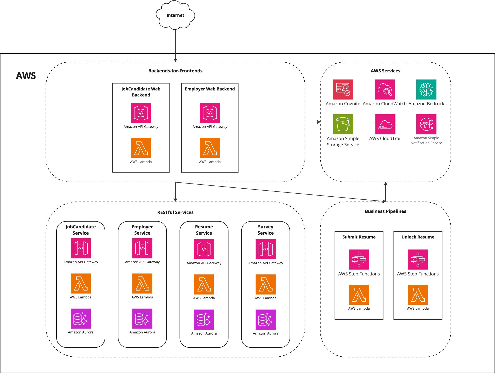

#Deployment

All the components of the system are deployed in a single AWS account in a single region (we propose us-east-2, Ohio).

The deployment may be automated by using the Infrastructure-as-a-Code (IaC) tools like AWS CloudFormation or Terraform. 
In addition, the serverless framework like [AWS SAM](https://aws.amazon.com/serverless/sam/) or 
[Serverless](https://www.serverless.com/) may be used to simplify the deployment of Lambda functions.