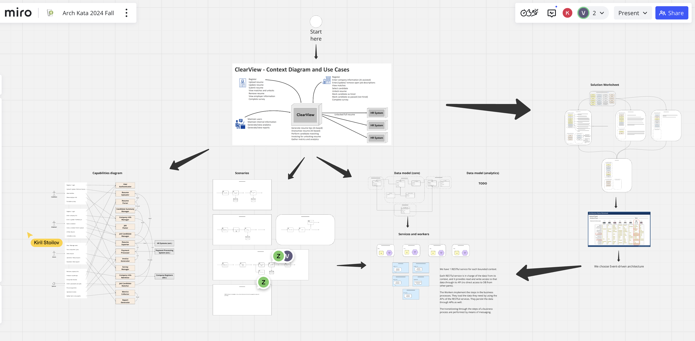
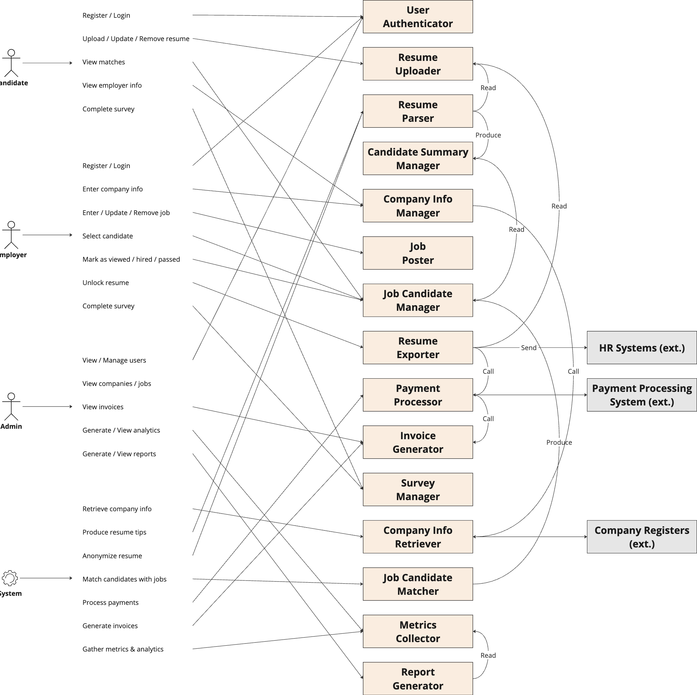
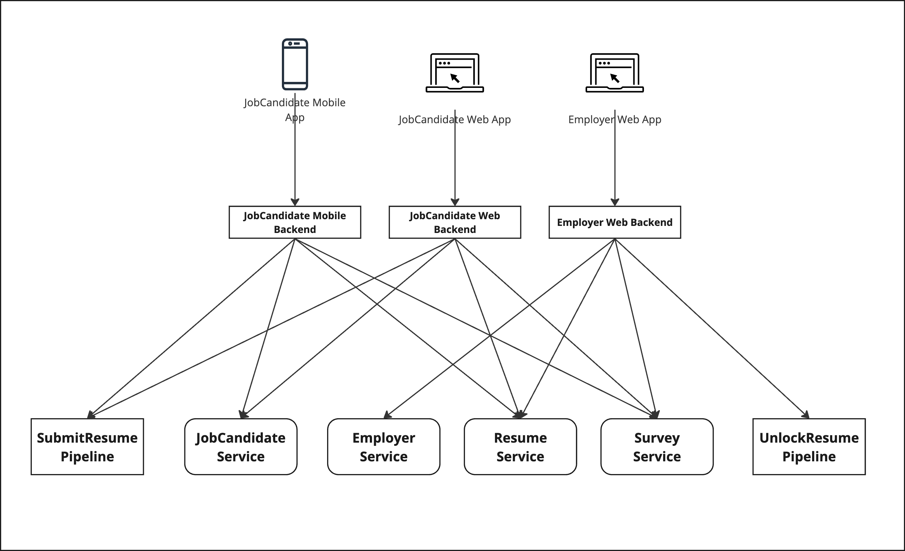
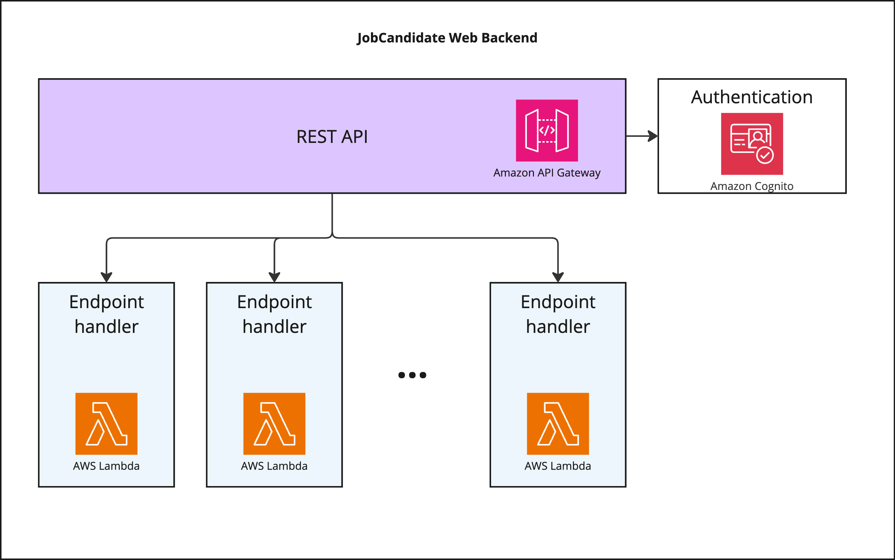

# Overview

This document is an overview of our solution for [ClearView](https://docs.google.com/document/d/1jCHMAvgzqaYaAp09br12OC4ozpVXZR3s9ezgEqncZ9U) 
system for Architecture Katas 2024 Fall. It describes our thought process and guides through the architecture and the 
decisions we have made.

# Our Team

We named our team by the name of our company - [Devexperts](https://devexperts.com/) - and we prepared this design in a 
team of 5 members, all from [Devexperts](https://devexperts.com/).

## Denis Iudovich

Role: Solution Architect

[LinkedIn](https://www.linkedin.com/in/denis-yudovich/)

Denis is a solution architect with 7 years of experience in development management in security and fintech domains.

## Ivan Kunyankin

Role: AI Team Lead

[LinkedIn](https://www.linkedin.com/in/ivan-kunyankin/)

Ivan has over five years of experience in data science, during which he has contributed to a variety of projects. He is 
leading a team focused on applying machine learning and AI in the fintech industry.

## Kiril Stoilov

Role: Solution Architect

[LinkedIn](https://www.linkedin.com/in/kiril-stoilov-9a30401)

Kiril is a solution architect and software engineer with over 20 years of experience spanning FinTech, Telecom, 
Gambling and Gaming industries with AWS hands-on expertise.

## Viktor Isaev

Role: Enterprise Architect

[LinkedIn](https://www.linkedin.com/in/weekens/)

Viktor is an architect and a software engineer with over 20 years of hands on experience in software development and 
design in many companies, both startups and enterprise. He is a certified AWS Solutions Architect Associate.

## Zhivko Angelov

Role: Solution Architect

[Linkedin](https://www.linkedin.com/in/zhivko-angelov)

Zhivko is an IT professional with over 20 years of experience as a software engineer, solution architect and delivery 
manager. He has a strong expertise in BI, Blockchain, API management and integration projects in the Fintech industry.

# Problem

## Requirements

A non-profit organization, Diversity Cyber Council, would like to establish a sustainable and diverse talent 
pipeline that extends career equity to underrepresented demographics. Their goals is to identify and reduce potential 
biases in the job candidate hiring and interview process, as well as to reduce redundancy and ineffectiveness of the 
traditional applicant tracking software matching viable candidates with job descriptions.

For this purpose, the organization strives to implement a supplemental HR platform - ClearView - that anonymizes candidate 
information while highlighting their objective skills and qualifying experience. Candidates will upload their resumes 
and the system will leverage AI to construct stories about them, while eliminating all personal information. Companies 
will post job descriptions and will pay to unlock matched profiles. Data points will be aggregated to reveal any 
disparities between those who are hired and those who were not selected.

## Assumptions

Based on the limited available requirements, we had to make a number of assumptions about the product scope:

- The organization is a non-profit, so it has a limited budget and lacks any existing IT infrastructure.
- The organization operates on the **US IT** market. We assume total addressable market of 1-5 M candidates and 
300-500K job posts. Within 3 years, we expect volume of 100K candidates and 100K job posts.
- We must design an architecture for a greenfield software system.
- This should be an **AP** (Availability - Partition Tolerance) system. Availability is critical, but consistency may 
be eventual.
- Latency is not super-critical. It does not matter much if a user request executes in 10 ms or 1000 ms. So it's not a 
real-time system.
- AI will be mostly (or totally) **LLM-based.**
- The organization is not affiliated with any given HR company or HR software. Therefore, there will be integrations 
with multiple HR systems.
- We assume that the key aspects of the system are: AI components, matching engine, analytics, and integration with HR 
system.
- We assume that the UI has low priority and it’s only web-based.

# Approach

We followed an architecture design approach with the steps below:

1. Acknowledge requirements
2. Define required assumptions to clarify the scope
3. Analyze architecture characteristics
4. Define the most appropriate architecture style
5. Identify product capabilities using the Actor/Action approach
6. Design core domain model
7. Design the solution architecture following C4 model
8. Prepare an overall context diagram
9. Prepare a container diagram
10. Prepare additional component diagrams to focus on key solution components
11. Document as ADRs the decisions we made throughout the entire process

We used [Miro](https://miro.com/) as a tool for drawing and collaboration.

We used [Coda](https://coda.io/) to prepare the documentation.

We had one week to design the architecture, so we conducted a multiple brainstorming sessions, as well as daily sync-up 
meetings.

This is how our Miro board looks like:

The deliverables of our architecture design are presented in the next sections.

# Architecture Characteristics and Style

Given the above assumptions, we started our design process with defining a 
[https://coda.io/d/_dF0G5Ugnocr/_suW4e](https://coda.io/d/_dF0G5Ugnocr/_suW4e) .

We identified the following driving characteristics of our architecture:

| **Characteristic** | **Why**                                                                                                                                                                                          |
|--------------------|--------------------------------------------------------------------------------------------------------------------------------------------------------------------------------------------------|
| Scalability        | Because the popularity of the service may grow, and the system should not require redesign when the usage grows 10x.                                                                             |
| Data integrity     | Because the customers have high expectations on data quality, and the cost of mistake is high. We better be unavailable that present invalid data to Employers.                                  |
| Extensibility      | Because the system must be extendable with new integrations with HR systems (we assume there will be a lot of those, with high variance).                                                        |
| Testability        | Because the system will have many components, and testing is non-trivial.                                                                                                                        |
| Security           | Because the access to personal data of candidates must be highly restricted, even to administrators. Data encryption should be enabled by design, regardless of the selected architecture style. |
| Availability       | Because the service will be used by wide audience 24/7.                                                                                                                                          |
| Workflow           | Because the business logic of user interactions consists of multiple steps separated in time, and is likely to evolve and change.                                                                |

Another important characteristic we identified is **Cost efficiency**, because we’re dealing with a non-profit 
organization, and we assume tough budget constraints.

Given the driving characteristics above, we have selected **Event-driven architecture** style in the Styles Worksheet, 
because it fits these characteristics best. This is our first architectural decision: 
[https://coda.io/d/_dF0G5Ugnocr/_suGBy](https://coda.io/d/_dF0G5Ugnocr/_suGBy) .

In terms of CAP theorem, we are concluded that we are building an AP system - we strive to high availability by giving 
up strong consistency and sticking to just eventual consistency (an update may not fully propagate through the system 
all at once, but it is guaranteed to *eventually* propagate).

# Thought Process and Architecture Decisions

## Capabilities

To illustrate the needs which the architecture must satisfy, we outlined the different types of actors in the system 
and their actions. Then we prepared a draft list of the components that are required to cover those actions.

We created the following capabilities diagram:

## Domain Model

By looking at the requirements, the usage scenarios described and the identified capabilities, we came up with our 
[Core Domain Model](Diagrams/Core%20Domain%20Model.png) .

Clearly the data of the Core Domain Model should be durably persisted in a reliable storage and should have robust 
protection from loss. We refer to this storage as Primary Database.

## Business Processes

Also, we identified the [Business Processes](Diagrams/Business%20Processes.md).

These business processes are quite simple, but each of them consists of multiple steps, most of which are 
[service tasks](Terms/Service%20Task.md). Most of the 
[service tasks](Terms/Service%20Task.md) require either loading the data from or 
saving data to the Primary Database.

## Services and Workers

Given the [Domain Model](#domain-model) and the [Business 
Processes](#business-processes), we came up to a high-level idea of RESTful Services and 
Service Workers.

A RESTful Service is a software component that takes care of a certain part of the data in the Primary Database and 
provides the access to that data by means of a RESTful API. This is driven by the corresponding architectural decision: 
[ADR-5 - RESTful Services](ADRs/ADR-5%20-%20RESTful%20Services.md).

We have one RESTful Service per [bounded context](Terms/Bounded%20context.md) of our 
Core [Domain Model](#domain-model). Each RESTful Service has its own database and has 
exclusive direct access to it. This way, our Primary Database is actually a set of RESTful Services with multiple 
separate physical databases.

While the RESTful Services follow from the 
[bounded contexts](Terms/Bounded%20context.md), the Service Workers follow from the 
[Business Processes](#business-processes). A Service Worker implements a 
[service task](Terms/Service%20Task.md) , and for each 
[service task](Terms/Service%20Task.md) in our business processes we have a 
Service Worker.

A Service Worker is triggered by an event of a business process pipeline. It should be resilient to failures and should 
be able to re-run the failed tasks until it succeeds. Our event-driven architecture should guarantee that no event is 
ever lost, and all the processing eventually completes.

The above leads us to a need for defining a technology for the RESTful Service **database engine**, and for the **event 
queue** for Service Workers, and we define those in 
[ADR-6 - Primary Database](ADRs/ADR-6%20-%20Primary%20Database.md) and 
[ADR-9 - Workflow Engine](ADRs/ADR-9%20-%20Workflow%20Engine.md) respectively.

## AI and Matching Engine

Once we have the Service Workers part, we can design Service Workers for:

- Resume anonymization
- Resume tips generation
- JobOffering requirements extraction
- Job matching

Of course this is done by using AI, and here we make a decision to use LLMs for our tasks: 
[ADR-3 - LLMs](ADRs/ADR-3%20-%20LLMs.md) .

Also, we have designed the architecture for Matching Engine, and we cover it in 
[ADR-8 - Matching Engine](ADRs/ADR-8%20-%20Matching%20Engine.md) .

## Authentication, Authorization, and Monitoring

We certainly need to secure our system with authentication and authorization, and we cover it in 
[ADR-4 - Auhtentication, Authorization](ADRs/ADR-4%20-%20Authentication,%20Authorization.md) .

For monitoring we use native AWS capabilities and services: [CloudWatch](https://aws.amazon.com/cloudwatch/) and 
[CloudTrail](https://aws.amazon.com/cloudtrail/). For improved security, more advanced services may be used, like [AWS 
Trusted Advisor](https://aws.amazon.com/premiumsupport/technology/trusted-advisor/). We do not give concrete 
recommendations here on how to configure monitoring metrics and alarms, because it is highly dependent on the 
operations team requirements.

## User Interaction

Users interact with the system through the user interfaces. There is a separate interface for JobCandidates (even 2: 
Web interface and mobile application), Employers, and Administrators. Each of these interfaces has a Frontend and a 
Backend part. Our architecture implies creating a dedicated Backend service for each Frontend, with an HTTP API 
tailored particularly for that Frontend (there is a Backend-for-Frontend - BFF - term in the industry exactly for 
mentioning this type of backends). Each Backend receives the requests from its respective Frontend, and handles them by 
using the API of the RESTful Services (in case it needs to read or modify the data of the Core Model) and by invoking 
the business pipelines (in case it needs to trigger a business process like “Submit Resume”).

Interaction with RESTful Services is always synchronous - we wait for response from all services, and if there is an 
error anywhere, we show an error to the user immediately.

Invocation of the business pipelines is always asynchronous - we receive an execution ID and report to the user that 
the process has started or the input has been accepted, and the rest happens in the background. When an execution 
finishes, we may notify the user by an email, SMS, or even through Comet Web Socket connection into their browser. We 
do not cover the concrete implementation in this design, because it strongly depends on the business requirements and 
marketing strategies.

The recommended internal architecture of a Backend-for-Frontend is very similar to the one recommended for RESTful 
Services. The difference is that in BFF there is typically no database - the BFF just delegates the work to the 
underlying RESTful Services and business pipelines.

On the Backend-for-Frontend level we perform the *authentication* of the users - we figure out *who* they are through 
the Authentication / Authorization service, and receive the JWT token that proves the user’s identity. The 
*authorization* - figuring out, what the user is *allowed* to do - is normally performed on the level of RESTful 
Services and business pipelines (they check the role inside the JWT token and decide whether they can allow a given 
action for that role). However, **in addition** to the RESTful Services and pipelines level of authorization, we may 
also perform authorization on the BFF level - for example, we may refuse to display an Employer interface to the users 
who are not Employers by their role.

## Analytics and Reporting

The analytics data model consists of two parts:

- Clickstream and UI analytics - this is handled by Google Analytics, and we don’t cover this part in our design, it’s 
pretty standard
- Event analytics

The Event analytics model is very simple: it’s a single entity which holds the data about all the business events that 
have occurred in the system.

The `key` field is an idempotency key - a unique identifier of an event.

The `payload` field is a full JSON payload of an event. In addition to `payload`, particular fields from the payload 
may be added as separate columns to simplify queries and optimize query processing.

The actual technology and architecture of the Analytics and Reporting part is covered in 
[ADR-10 - Analytics and Reporting](ADRs/ADR-10%20-%20Analytics%20and%20Reporting.md) .

# C4 Model

Our C4 models describe the structure of the system and can be found here: 
[C4](Diagrams/C4.md) .

# Architecture Decision Records

All our architecture decision records (ADRs) can be found [here](ADRs).

# Deployment

We have chosen to use AWS as a cloud provider and to leverage its rich set of out-of-the-box services, as described in 
[ADR-2 - Cloud Architecture](ADRs/ADR-2%20-%20Cloud%20Architecture.md), and covered in 
[Deployment Diagram](Diagrams/Deployment%20Diagram.md) .

# Data Protection

All AWS storage components that we use support data encryption at rest and in transit with either AWS-managed 
encryption keys or customer-managed encryption keys.

# Cost Estimation

For cost estimation we made the following assumptions:

> The monthly active users (MAU) will be approximately up to 1000 per month at the start. 25% of the users will be the 
Employers, and they will use the service multiple times per day, and all the rest are JobCandidates and they are going 
to probably use the service just once a week or so.

Based on the assumption above, we estimated the following monthly costs:

AWS services: $704 (estimate [here](https://calculator.aws/#/estimate?id=8927b6f191aa0c4a2b0410a4508aa278014eabb8))

The **yearly total cost** of the whole infrastructure is: **$8448**

# **Postponed Decisions or Well-known Issues**

We have skipped overs some architectural decisions and technical nuances, which are seemingly easy to design having our 
architecture documentation at hand.

| Decision                      | Why postponed?                                                                                                                                                                                                                                                                                                               |
|-------------------------------|------------------------------------------------------------------------------------------------------------------------------------------------------------------------------------------------------------------------------------------------------------------------------------------------------------------------------|
| Frontend architecture         | Frontend architecture is highly dependent on the actual team that is going to implement UIs for ClearView. Also, the Frontends are pretty much isolated from the rest of the system, so the architectural decisions there do not affect the rest of the architecture by and large.                                           |
| Administration                | The design of administrative applications and workflows is easy to make by analogy to all the rest that is done in the system. The domain model, the RESTful Service, the Backend-for-Frontend and the UI application will just follow the same pattern that other components follow.                                        |
| Survey logic                  | Due to the lack of time, we haven’t designed the business process for the interviewing and the surveys, but they will use the same technologies and follow the same architectural approach.                                                                                                                                  |
| DDoS protection               | It boils down to merely using AWS Shield Standard or Shield Advanced. The actual settings depend on the traffic pattern.                                                                                                                                                                                                     |
| Mobile application            | We slightly touched the idea that there will be mobile application for JobCandidate, but we did not elaborate on it in most of our diagrams just to keep them simple. Mobile application is just another Frontend that would have additional Backend-for-Frontend and follow the same logic all the rest of the apps follow. |
| Company information assistant | On our Context diagram we display the integration with LinkedIn API to pull the public data of the Employers and simplify the Employer registration. We didn’t have time to cover this integration in more detail.                                                                                                           |
| Resume removal                | Resume removal by JobCandidate is a separate business pipeline, and we did not design this pipeline due to the lack of time.                                                                                                                                                                                                 |
